# FSRCNN Experiment Report

## Default config

#### Network Structure

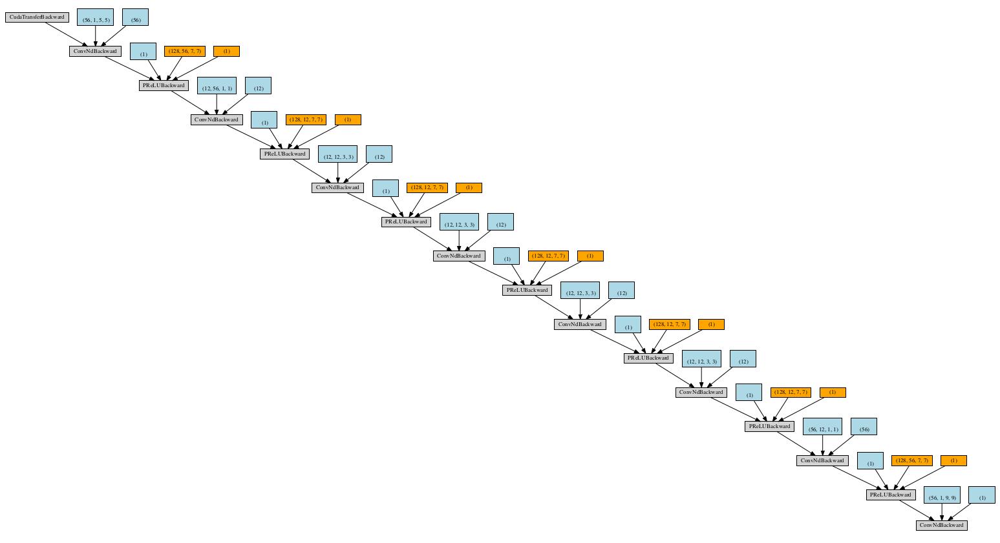 

Number of output channels in the fisrt convolution layer (feature extraction) and  the last cinvolutional layer (expanding) is 56. Number of channels in the non-linear mapping part (convolution layers betweenthe first convolution layer shinking layer and expanding layer) (s) is 12. Number of non-linear layers (m) is 4.

#### Super parameters

Number of epoch: 100

batch size:

​	For training

| Epoch  | Batch size |
| ------ | ---------- |
| 1, 2   | 1          |
| 3, 4   | 2          |
| 5, 6   | 4          |
| 7, 8   | 8          |
| 9, 10  | 16         |
| 11, 12 | 32         |
| 13, 14 | 64         |
| 15-100 | 128        |

​	For finetune:

​		Batch size is 128.

#### Model parameters initialization

Weights:	

​	Guassian distribution:

​		Mean: 0

​		Variance: $\sqrt{2/\text{filter number}/\text{filter size}^2}$ (MSRA)

Bias:

​	Initialize to 0.

#### Criterion

Mean-square-error

#### Optimizer SGD

base learning rate: 0.001

​	For all bias parameters in covolution layers and all parameters in transposed convolution layer, the learning rate is 0.1 times of base learning rate.

momentum: 0.9

#### Training dataset

Patched 91-images, patched 191-images, patched 91-images residual and 191-images residual.

91-images residual and 191-images residual is producedby both rotating all image $0^{\circ}, 90^{\circ}, 180^{\circ}, 270 ^{\circ}$, and scale to $0.6, 0.7, 0.8, 0.9$.

Patch config:

​	input patch size: 11

​	target patch size: 19

​	scale: 3

​	patching stride: 9

​	Bicubic Downsampleing

#### Testing Dataset

Set 5 and Set14 without patching.

All images for testing may be croped according to the model structure (use biliear downsampling), so that the output of the model will be interger size.

For all images during testing, cut edges pixel according to the padding parameter in the last transposed convolusion layer and then calculate PSNR.

## 1 Residual vs no-residual

| Train dataset                    | 91-images                                                    | 91-images-residual                                           |
| -------------------------------- | ------------------------------------------------------------ | ------------------------------------------------------------ |
| PSNR(dB) for Set 5               | 24.27                                                        | 26.73                                                        |
| PSNR(dB) for Set 14              | 22.88                                                        | 24.62                                                        |
| First layer filter initilization | 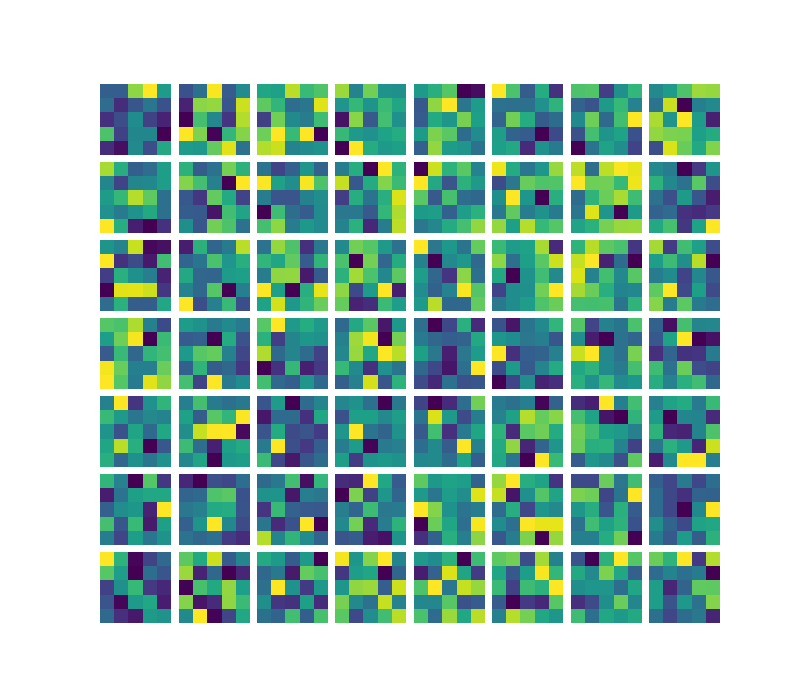 | 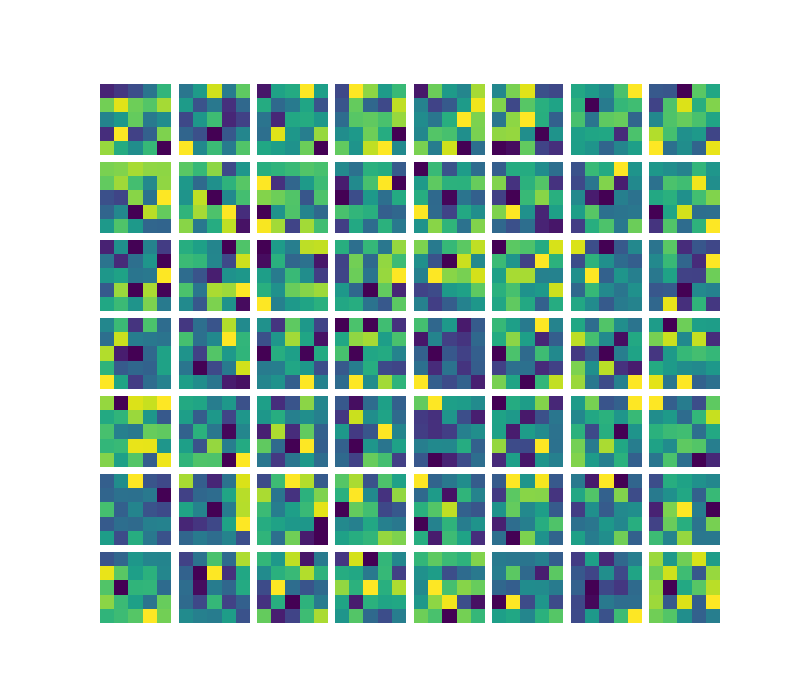 |
| First layer filter after trained | 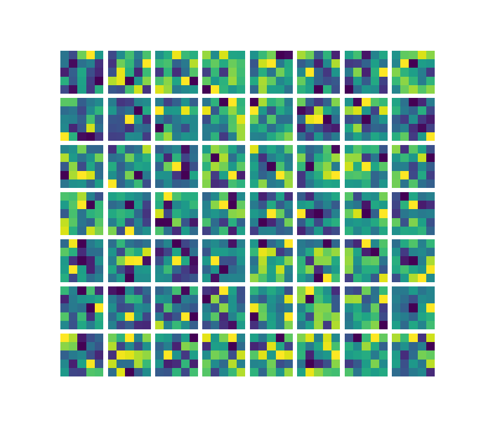 | 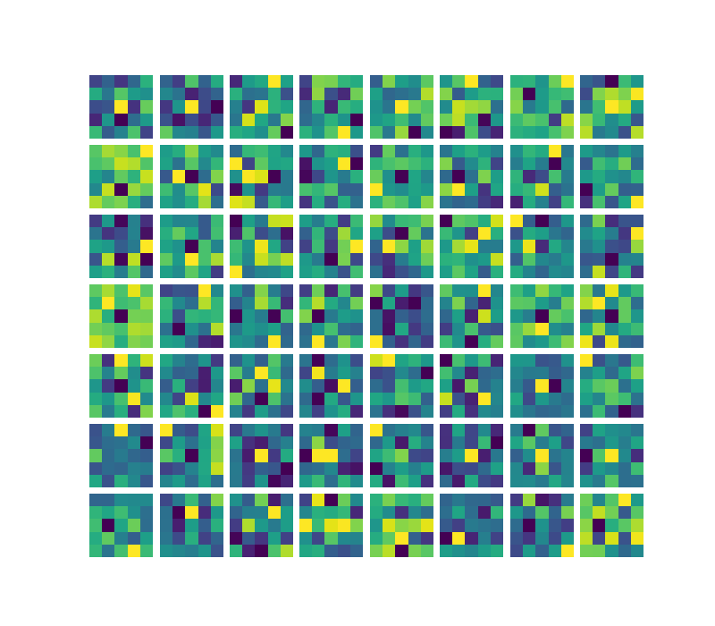 |
| Last layer filter initilization  |  |  |
| Last layer filter after trained  | 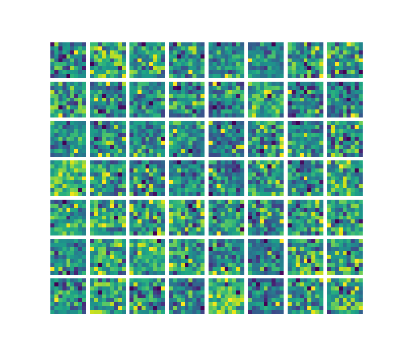 | 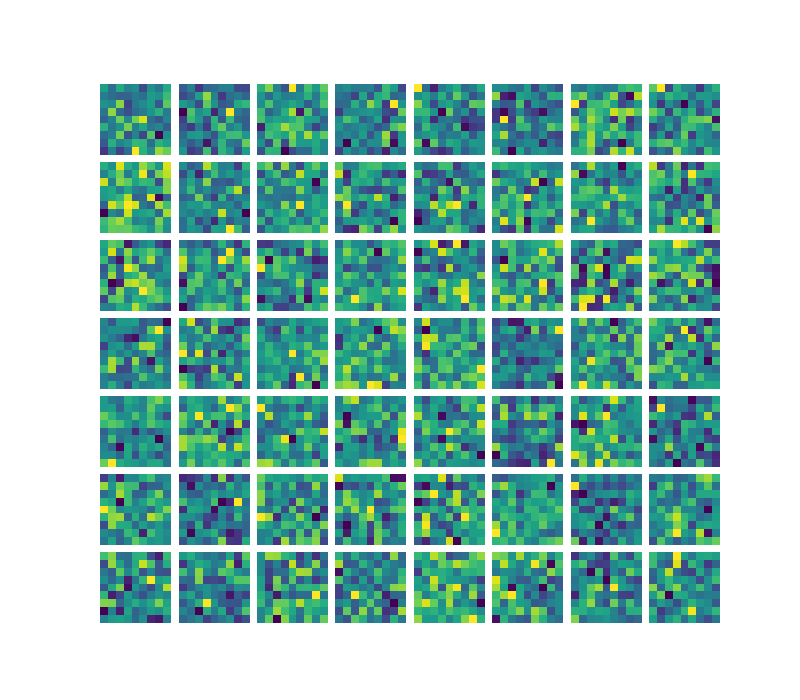 |
| Result                           |  |  |
| Phenomenon                       | The chessboard artifacts is significant, and the grayscale is slightly different than original. The whole image is under focus. | The acutance is lower, but still better than bicubic upsamplin. And the grayscale is more accurated. |

| Ground truth                                      | Bicubic upsampling image                           |
| ------------------------------------------------- | -------------------------------------------------- |
|  |  |

#### Iteration

The brown line is the data trained on 91-images.

The blue line is the data trained on 91-images-residual.

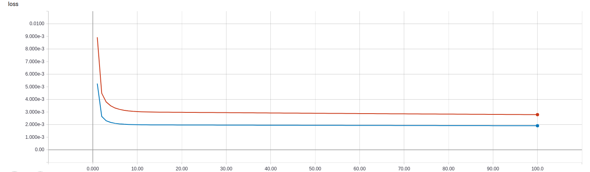

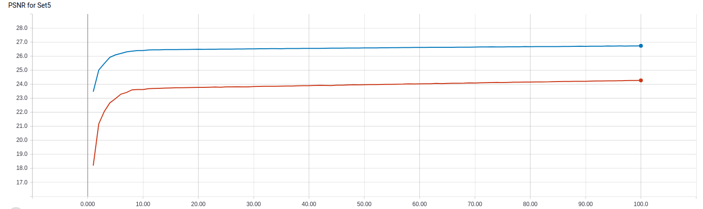

## 2 Initialization method

Use 91-images training dataset.

Xavier : $$\text{Xavier}(\sqrt{2/\text{filter number}/\text{filter size}^2})$$

| Guassian variance                | MSRA                                                         | Xavier |
| -------------------------------- | :----------------------------------------------------------- | ------------------------------------------------------------ |
| PSNR(dB) for Set 5               | 24.27                                                        | 22.56                                                        |
| PSNR(dB) for Set 14              | 22.88                                                        | 21.38                                                        |
| First layer filter initilization |  | 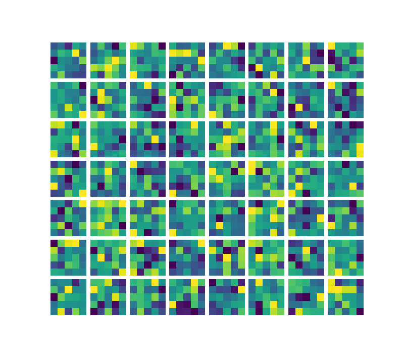 |
| First layer filter after trained |  | 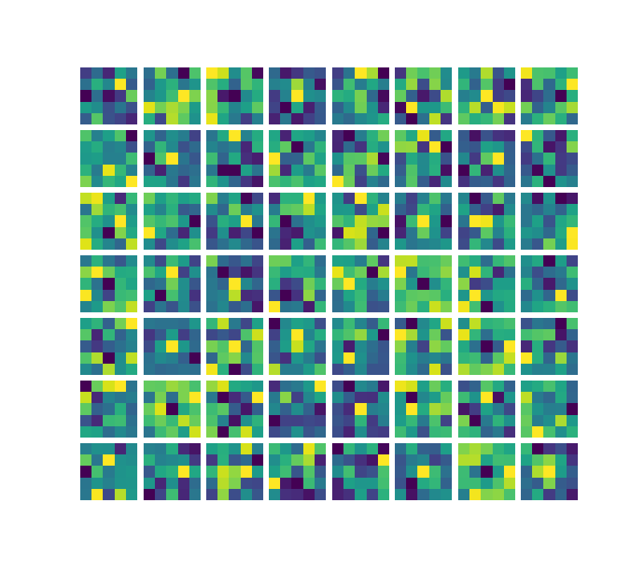 |
| Last layer filter initilization  |  | 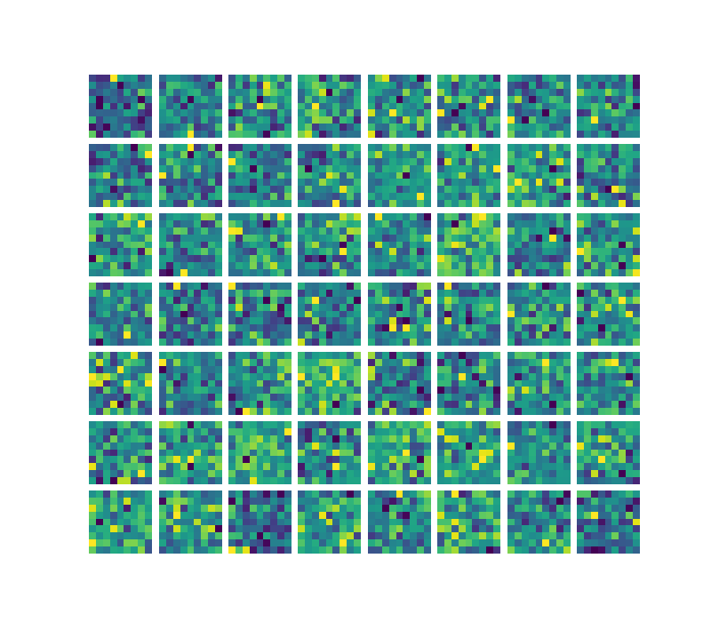 |
| Last layer filter after trained  |  |  |
| Result                           |  | 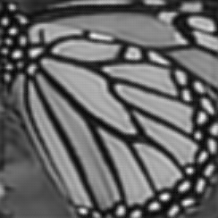 |

#### Phenomenon

In the result generated from model use Xavier initilization. The under focus problem is serious. The edge between huge different grayscale become white. But the chessboard artifacts is less. The dark grayscale is more accurated.

#### Iteration

The brown line is the data from model use MSRA.

The cyan line is the data from model use Xavier.

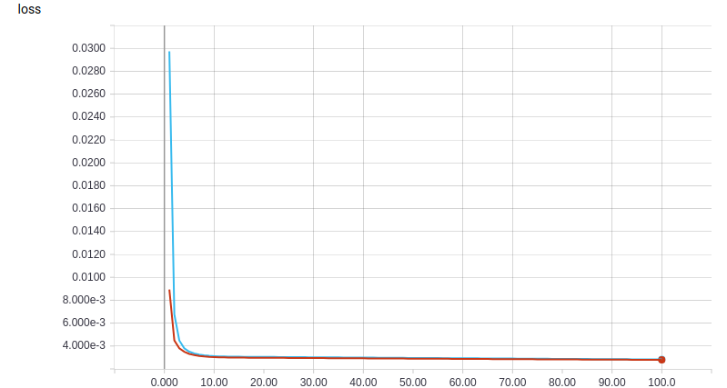

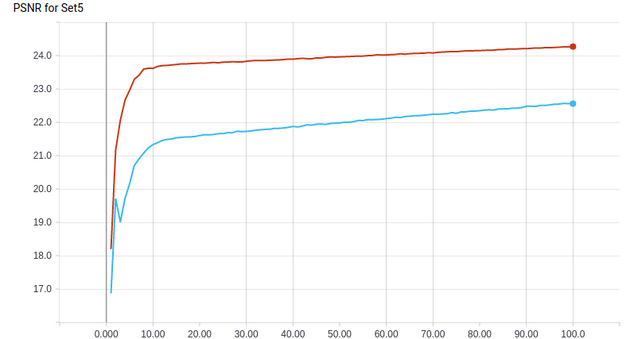

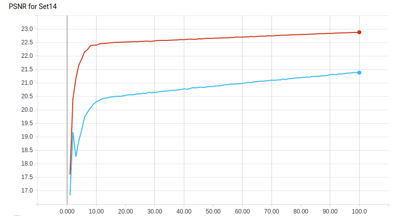

## 3 Datasize

| Train dataset                    | 191-images-residual                                          | 91-images-residual                                           |
| -------------------------------- | ------------------------------------------------------------ | ------------------------------------------------------------ |
| PSNR(dB) for Set 5               | 27.67                                                        | 26.73                                                        |
| PSNR(dB) for Set 14              | 25.36                                                        | 24.62                                                        |
| First layer filter initilization | 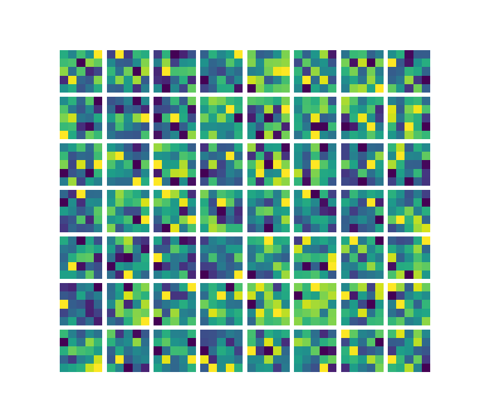 |  |
| First layer filter after trained |  |  |
| Last layer filter initilization  | 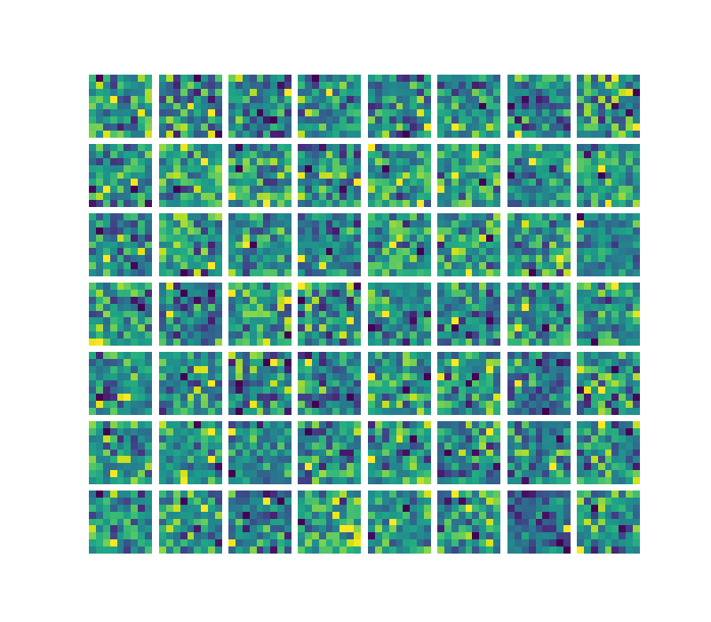 |  |
| Last layer filter after trained  | 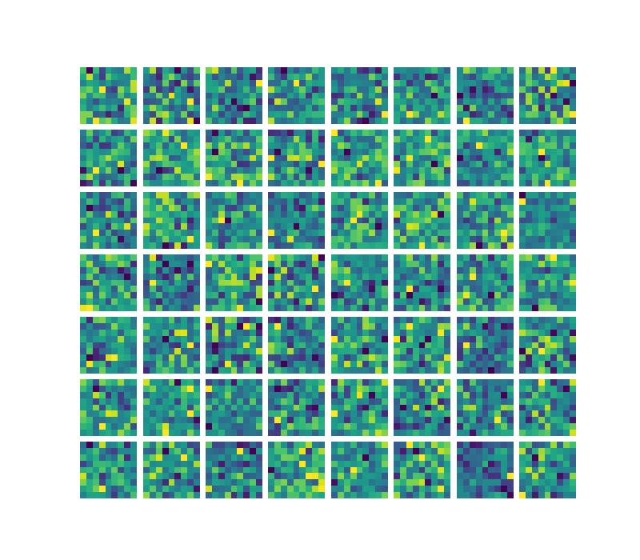 |  |
| Result                           |  |  |

#### Iteration

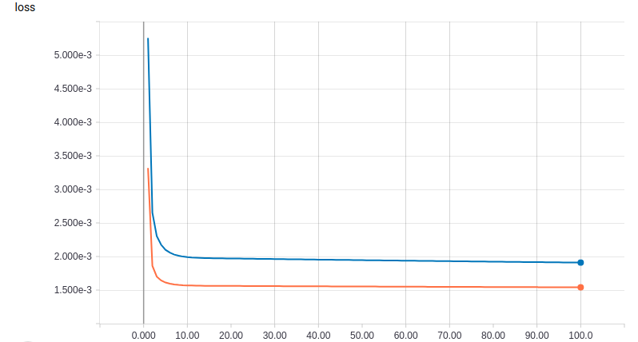

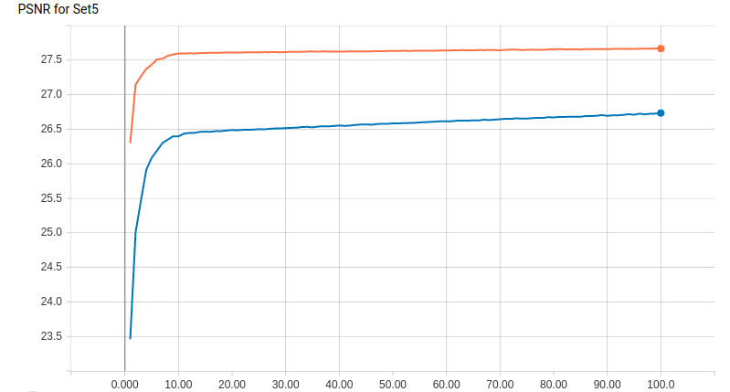

#### Phenomenon

There is no obvious difference between the result images, but the PSNR data shows that larger dataset can get better relult.

## 4 Loss

#### Network structure

Compare to the default structure, remove shrinking and expanding layers.

Number of channels in the non-linear mapping part (convolution layers) (s) is 10.

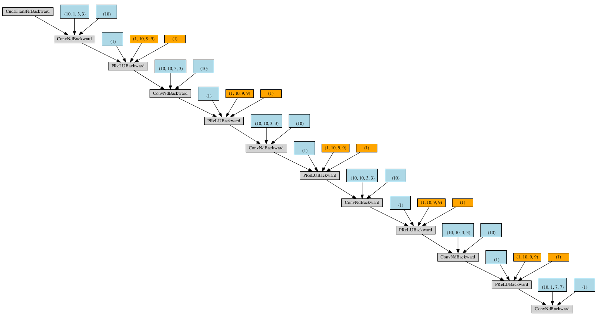

The base learning rate is set to 0.01. Use 91-images-residual as trainning data.

| Loss function        | Huber   | Huber | Huber | Charbonnier | Charbonnier | Charbonnier | L2    |
| -------------------- | ------- | ----- | ----- | ----------- | ----------- | ----------- | ----- |
| Delta          | 0.00001 | 0.6   | 0.9   | 0.01        | 0.001       | 0.0001      | /     |
| PSNR for Set 5 (dB)  | 54.23*  | 30.83 | 30.80 | 5.538       | 7.334       | 6.182       | 27.91 |
| PSNR for Set 14 (dB) | 54.12*  | 28.46 | 28.42 | 4.406       | 4.979       | 5.125       | 25.54 |

*The PSNR values are extremely high, which is abnormal. 

#### Convergence curve

The orange line shows the data from the modal with Huber loss and $\delta=0.6$.

The borwn line shows the data from the modal with Huber loss and $\delta=0.9$.

The cyan line shows the data from the modal with L2 loss.
S
The magenta line shows the data from the modal with Charbonnier loss and $\delta=0.01​$.

The green line shows the data from the modal with Charbonnier loss and $\delta=0.001$.

The gray line shows the data from the modal with Charbonnier loss and $\delta=0.0001$.

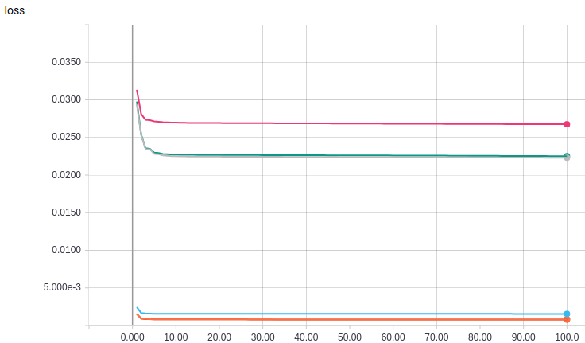

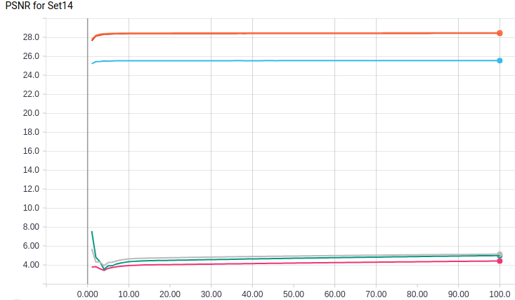

#### Result

| Loss function | Huber                                                        | Huber                                                        | L2                                                           |
| ------------- | ------------------------------------------------------------ | ------------------------------------------------------------ | ------------------------------------------------------------ |
| $\delta$      | 0.6                                                          | 0.9                                                          | /                                                            |
| Result        |  |  |  |

| Loss function | Charbonnier                                                  | Charbonnier                                                  | Charbonnier                                                  |
| ------------- | ------------------------------------------------------------ | ------------------------------------------------------------ | ------------------------------------------------------------ |
| $\delta$      | 0.01                                                         | 0.001                                                        | 0.0001                                                       |
| Result        |  |  |  |

#### Abnormal data analysis

The result of model use Huber function with $\delta=0.00001$ is showed belowed, which is totally disagree the high PSNR. So we ignore this data. 

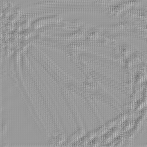

The below image shows the difference between the initial weights of deconvolution layer and the weights after trained. Only 2 weights changed. So we can guess that the model is failed during back propagation, and may because the value of loss is too small.

#### Conclusion

When training using Charbonnier Loss, larger $\delta$ leads to richer detail, but the difference in the image is slight. Considering the PSNR value,  $\delta=0.001$ is a better choice. But the PSNR value for all model use Charbonnier loss is seems too low, while the result images are generally same as using Huber loss and L2 loss. 

The result generated using L2 loss has too high acutance, the result generated using Huber loss or Charbonnier loss can solve this problem. And Charbonnier loss leads to less chessboard artifacts.

For Huber loss, too high $\delta$ makes it be limited different from L2 loss. From the result, we can find out that $\delta=0.6$ is slightly better, which can generate more precise grayscale in darker pixels. And analysis the PSNR value, $\delta=0.6$ can get around 2db imrpovement from $\delta=0.9$. A suitable $\delta$ can reduce the effects taht  some pixels that has huge difference leads to a high loss, because there must exists some small details that cannot be generated, such as a single white pixel  in a huge darker zone.

## 5 Parameter number

The model structure is modified based on the structure in the above section. The middle number  in the name means numbers of channels in non-linear mapping part) (s). The last number means number of convolution layers in non-linear mapping part (m).

Use 91-images to train the model firstly. The base learning rate is set to 0.01.

Then use 191-images to finetune the model. The learning rate is set to 0.001, use 191-images as training dataset. 

| Name                                | N2-8-3                                                       | N2-10-4                                                      | M2-14-4                                                      |
| ----------------------------------- | ------------------------------------------------------------ | ------------------------------------------------------------ | ------------------------------------------------------------ |
| PSNR for Set 5 after training (db)  | 27.62                                                        | 27.70                                                        | 27.81                                                        |
| PSNR for Set 14 after training (db) | 25.13                                                        | 25.28                                                        | 25.43                                                        |
| PSNR for Set 5 after finetune (db)  | 27.62                                                        | 27.69                                                        | 27.81                                                        |
| PSNR for Set 14  after finetune(db) | 25.14                                                        | 25.29                                                        | 25.43                                                        |
| Result after training               |  |  |  |
| Result after finetune               |  |  | 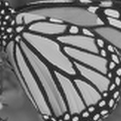 |

#### Cinvergence Curve

The megenta line is the data from N2-10-4 trainning.

The green line is the data from N2-10-4 finetuning.

The gray line is the data from N2-14-4 trainning.

The orange line is the data from N2-14-4 finetuning.

The blue line is the data from N2-8-3 trainning.

The brown line is the data from N2-8-3 finetuning.

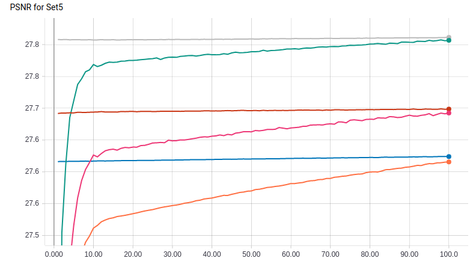

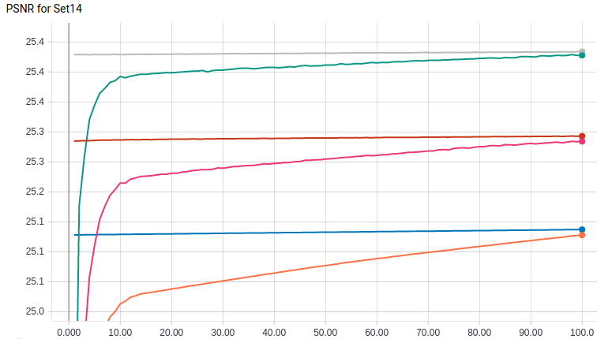

#### Conclusion

Generally, larger network and more channels leads to better result. For all 3 model, finetuning can leads to better PSNR, but the improvement is very small. But if zoom out the PSNR curve, the gradient of the finetune curves do not significantly decreased, so I guess that continuing finetuning can leads to more improvement but will not change the result significantly. All the result images have not significant visual difference.

## 6 Bicubic vs bilinear

Use N2-10-4 trained but not finetuned model in Section 5.

Then use 191-images to finetune the model. The learning rate is set to 0.001, use 191-images as training datase, or use 191-images (bilinear downsampling).

| Downsampling         | Bicubic                                                      | Bilinear                                                     |
| -------------------- | ------------------------------------------------------------ | ------------------------------------------------------------ |
| PSNR for Set 4 (dB)  | 27.71                                                        | 27.78                                                        |
| PSNR for Set 15 (dB) | 25.30                                                        | 25.38                                                        |
| Result               |  |  |

#### Convergence curve

The megenta line is the finetune data for dataset use bilinear downsampling.

The cyan line is the finetune data for dataset use bicubic downsampling.

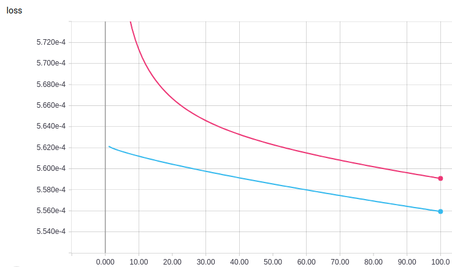

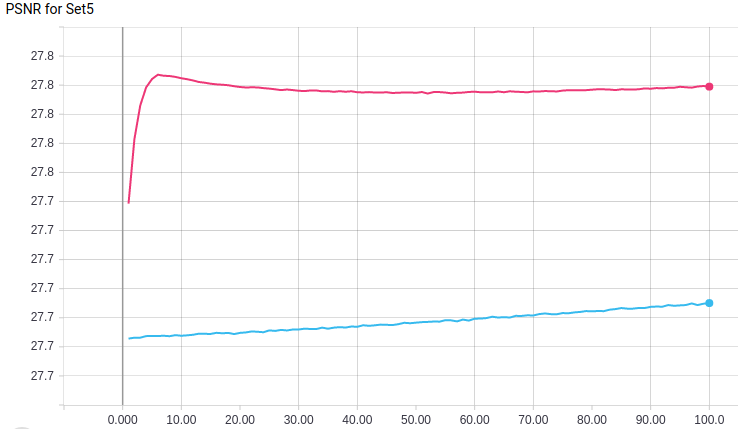

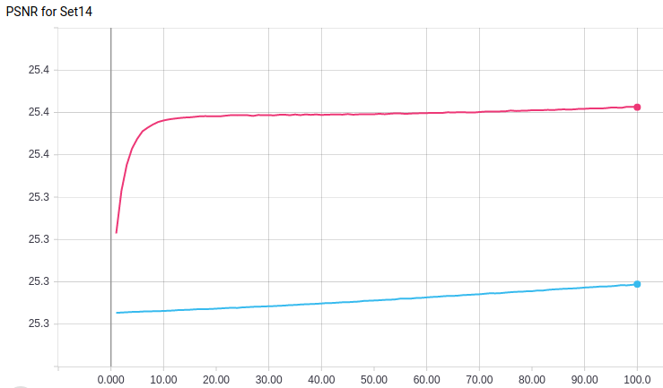

#### Conclusion

Bilinear downsampling dataset can get higher PSNR and lower loss than bicubic one. Guess that the reason is that the test dataset input is generated by using bilinear downsampling.

## 7 x2 & x4

Modify the network based on network N2-10-4 in Section 5.

x2 means change the stride in deconvolution layer to 2.

x4 means change the stride in deconvolution layer to 4.

Use 91-images to train the model firstly. The base learning rate is set to 0.01.

Then use 191-images to finetune the model. The learning rate is set to 0.001, use 191-images as training dataset. 

| stride                              | x2                                                           | x4                                                           |
| ----------------------------------- | ------------------------------------------------------------ | ------------------------------------------------------------ |
| PSNR for set 5 after train (dB)     | 20.42                                                        | 23.93                                                        |
| PSNR for set 5 after finetune (dB)  | 19.88                                                        | 23.93                                                        |
| PSNR for set 14 after train (dB)    | 20.03                                                        | 22.35                                                        |
| PSNR for set 14 after finetune (dB) | 19.29                                                        | 22.35                                                        |
| Result after train                  | 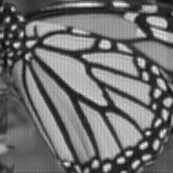 | 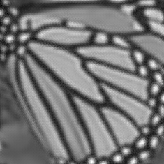 |
| Result after finetune               |  | 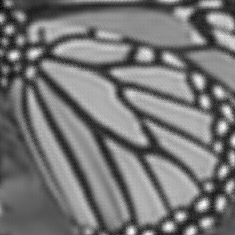 |

#### Convergence curve

The green line is the training data for x2.

The gray line is the finetune data for x2.

The orange line is the training data for x4.

The blue line is the finetune data for x4.

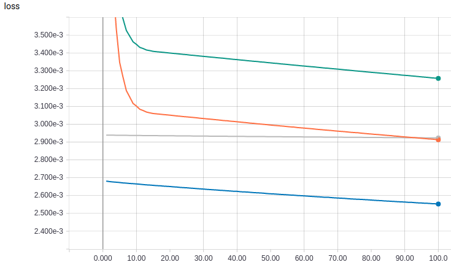

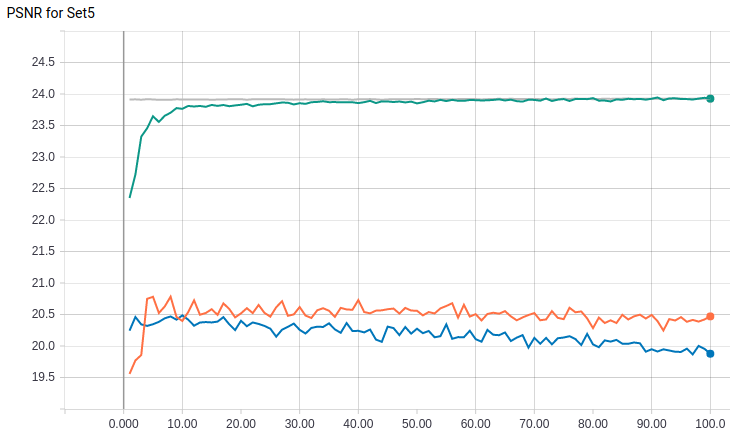

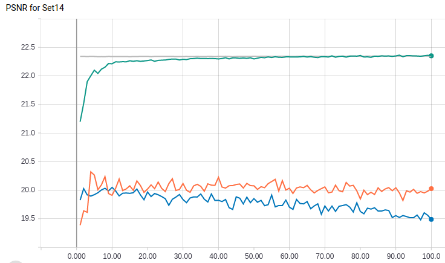

#### Conclusion

Obviously, x2 get better effort than x4. And the PSNR value is more stable during training and finetuning. Also, for x4, finetuning leads to lower PSNR, while for x2, PSNR value increse negligibly. Guess that for x2, the model is overfitting.

## 8 conv vs deconv

Use the below network structure:

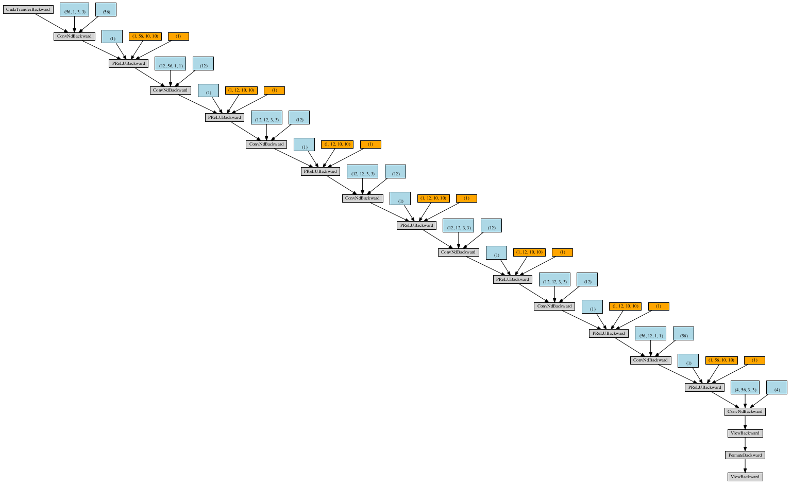

Due to the network cannot scale image from 11x11 to 19x19, change the input patch size to 12x12, and target is 20*20 in traning dataset. Other parameters remains the same as default.

The output channels of last convolution layer is $\text{numbet of channels  in images} * 2 * 2$, which means scale is 2, kernal size is 3, stride is 1, padding is 1. In the last layer, use pixel shuffule ;ayer to shuffle the data in to an image, the upscale factor is setting to 2.

#### PSNR result

PSNR for Set 5 is 20.27dB.

PSNR for Set 14 is 20.46dB.

#### Result

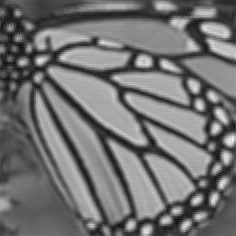

#### Convergence curve

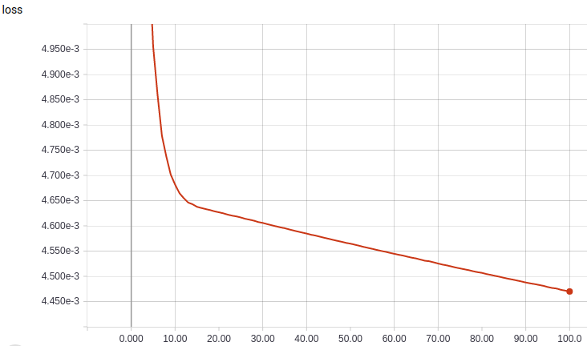

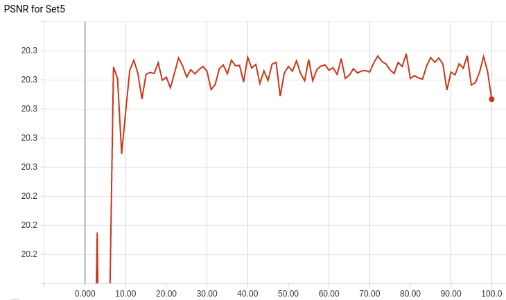

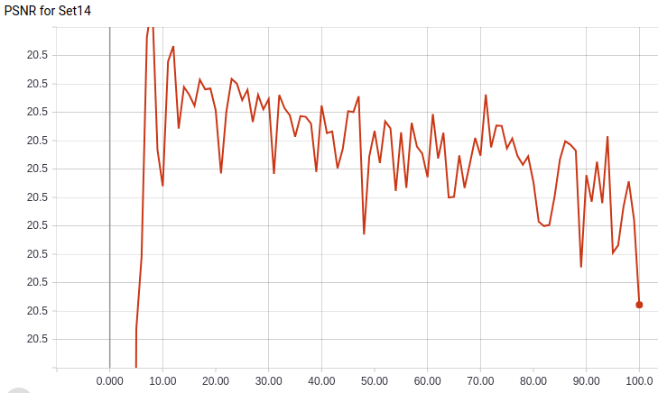

#### Conclusion

Compare to the result in Section 1 using 91-images as trainning dataset, the PSNR value is lower, and the acudance is much lower. The result has mo more detail than the input, but the chessboard artifects is not as serious as using deconvolution layer. In a sentence, use deconvolution to upsample is better than use convolution.

The trending of PSNR value for Set 14 is descending after epoch 8, it seems that there exists overfitting, but PSNR for Set 5 dies not descending. The result in different epoches after epoch 10 has no visible difference, so cannot sure that it is overfitting.

 